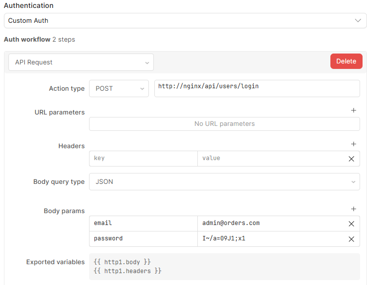
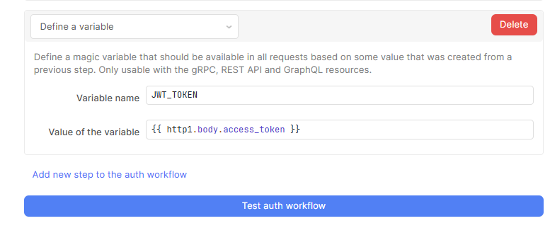
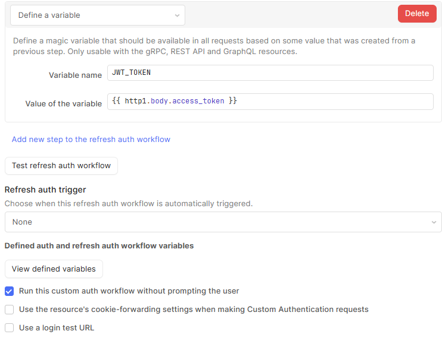

# Order Management System for an E-Commerce Platform

- Built with **FastAPI** and **PostgreSQL**
- Ensures **transactional integrity** for digital purchases
- Supports **user authentication** and secure order handling
- Includes a **simple, user-friendly frontend** for managing orders
- Comes bundled with **Retool**, configured via Docker Compose
- Includes a **prebuilt Retool dashboard** export for immediate use

---

## TODO

- Add more integration tests
- Add MCP support
- Add billing logic
    - Track user funds
    - Only allow purchase if user has enough funds
- Add more custom errors
    - InsufficientFundsError
    - ProductUnavailableError
- Improve logging
    - Logging to external source (Grafana/Prometheus)
    - Improve log formatting and structure
    - Add external logging configuration support
- IAAS - terraform
- Cloud deployment
    - Support development and production mode
    - Consider automating migration
- Https support
- Add async support for backend

---

## How to Set up

### Prerequisites

- Docker and Docker Compose
- Python 3.11+

### Steps

1. Clone the repository:
   ```bash
   git clone git@github.com:gomri15/order-management.git
   cd order-management
   ```

2. Create `order-app.env` files:
    ```bash
    cp .env.example order-app.env
    ```

3. Start services (here you have 2 options, with Retool or without, the reason we have both is in case you have a machine with a small amount of resources):

   ### Without Retool
    ```bash
    docker compose up --build -d
    ```

   ### With Retool
   Note: If working locally and want to use retool
   Go to https://docs.retool.com/self-hosted/tutorials/docker?temporal=local
   Log in to Retool and get your license_key from https://my.retool.com/
   Paste your license key into `docker.env` at the License key section

   ```bash
   ./install.sh
   docker compose -f docker-compose-with-retool.yml up --build -d
    ```

4. Run Alembic migrations:
   ```bash
   docker exec -it orders-backend alembic upgrade head
   ```

5. Optional: Seed the database
   ```bash
   docker exec -it orders-backend python seed_database.py
   ```

6. Access the app: http://localhost/index.html


7. (Optional) Access Retool:
   Visit [http://localhost:3000](http://localhost:3000) to open the Retool UI.

---

## Environment Variables

`order-app.env` is used for the FastAPI app and PostgreSQL
database.

| Variable            | Description                        |
|---------------------|------------------------------------|
| `POSTGRES_DB`       | Name of the DB used by the app     |
| `POSTGRES_USER`     | Database user                      |
| `POSTGRES_PASSWORD` | Database password                  |
| `POSTGRES_HOST`     | Hostname of the Postgres container |
| `POSTGRES_PORT`     | Postgres port                      |
| `SECRET_KEY`        | Key for JWT generation             |

#### With Retool:

`docker.env` is used for Retool and FastAPI app.

| Variable                      | Description                 |
|-------------------------------|-----------------------------|
| `ACCESS_TOKEN_EXPIRE_MINUTES` | Token expiration in minutes |
| `RETOOL_LICENSE_KEY`          | License key for Retool      |

---

## Architecture Overview

- FastAPI app handles business logic and exposes REST endpoints
- PostgreSQL
  stores users, products, orders, and transactions
- Docker Compose manages multi-container orchestration
- Nginx serves as a reverse proxy for the `orders-backend` and `orders-frontend`, configured by `nginx.conf`

---

### Swagger

http://127.0.0.1/api/docs

---

## Testing

1. Unit tests

    ```bash
    docker exec -it orders-backend pytest app/tests/unit/
    ```

2. Integration tests
   > ⚠️ These tests clear the DB. Use with caution.
    ```bash
    docker exec -it orders-backend pytest app/tests/integration/
    ```

3. Coverage report
    ```bash
    docker exec -it orders-backend pytest --cov=app --cov-report=term-missing app/tests/
    ```

---

### Retool Dashboard Setup

To use the prebuilt dashboard:

1. Open [http://localhost:3000](http://localhost:3000)
2. Create User (if not already done)
3. Go to **Apps → Create New → Import**
4. Select the provided `retool_export.json` file
5. Go to **Resources → Create new**
    - Choose **REST API**
    - Name it whatever you like, below is an example of the configuration
    - 
    - 
    - 
    - 
6. Go back to Apps and click View on the imported app

## Woohoo!?? you should see the app and have full admin functionality

---

### Contact

For questions or contributions, please open an issue or submit a PR.
Or contact gomri15@gmail.com